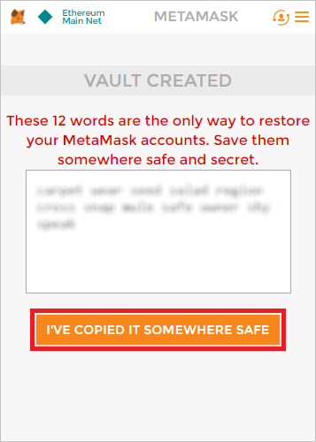
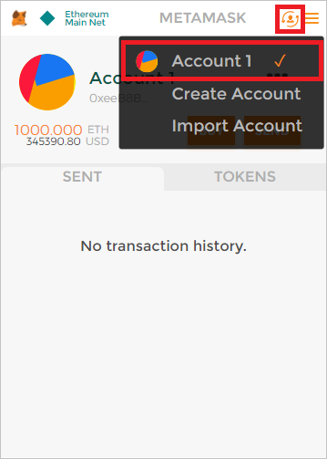

<a name="HOLTitle"></a>
# Blockchain-as-a-Service on Azure #

[Blockchain](https://en.wikipedia.org/wiki/Blockchain) is one of the world's most talked-about technologies, and one that has the potential to fundamentally change the way we use the Internet. Originally designed for [Bitcoin](https://en.wikipedia.org/wiki/Bitcoin), Blockchain remains the technology behind that digital currency but is not limited to applications involving virtual money. In the words of Dan Tapscott, author, TED speaker, and Executive Director of the [Blockchain Research Institute](https://www.blockchainresearchinstitute.org/), "Blockchain is an incorruptible digital ledger of economic transactions that can be programmed to record not just financial transactions, but virtually everything of value." One of the more inventive uses for Blockchain is to implement tamper-proof digital voting systems, a concept that is being actively explored [in the U.S. and abroad](https://venturebeat.com/2016/10/22/blockchain-tech-could-fight-voter-fraud-and-these-countries-are-testing-it/).

Blockchain gets its name from the manner in which it stores data. Transactions such as a transfer of money from one party to another or a vote cast for a political candidate are stored in cryptographically sealed blocks. Blocks are joined together into chains ("blockchains"), with each block in the chain containing a hash of the previous block. A blockchain acts like an electronic ledger, with blocks replicated across countless computers (nodes) in a Blockchain network rather than stored in one place. This decentralization means that a blockchain has no single point of failure and is controlled by no single entity. The latter is especially important for a system whose primary goal is to allow private transactions to take place without involving a "trusted" third party such as a bank.

Anyone can build a Blockchain network and use it to host blockchains. Microsoft Azure makes it incredibly simple to do both by supporting Blockchain-as-a-Service. A few button clicks in the Azure Portal are sufficient to deploy a network of virtual machines provisioned with popular Blockchain implementations such as [Ethereum](https://www.ethereum.org/), [Corda](https://www.corda.net/), or [Hyperledger Fabric](https://www.hyperledger.org/projects/fabric).

Ethereum was one of the first general-purpose Blockchain implementations. The software is open-source and is the basis for Ethereum's own cryptocurrency known as [Ether](https://www.ethereum.org/ether). You can deploy Ethereum networks of your own and use its Blockchain implementation however you wish. Among other features, Ethereum supports [smart contracts](https://en.wikipedia.org/wiki/Smart_contract), which are written in languages such as [Solidity](https://en.wikipedia.org/wiki/Solidity) and then compiled into bytecode and deployed to the blockchain for execution.

In this lab, you will deploy an Ethereum network on Azure and create your own cryptocurrency named "My Coin" to run on it. The currency will be brokered by a smart contract that allows funds to be transferred between accounts. Along the way, you will get first-hand experience running Blockchain networks on Azure.

<a name="Objectives"></a>
### Objectives ###

In this hands-on lab, you will learn how to:

- Deploy an Ethereum blockchain network on Azure
- Use MetaMask to create an Ethereum wallet
- Write smart contracts and deploy them to Ethereum networks

<a name="Prerequisites"></a>
### Prerequisites ###

- An active Microsoft Azure subscription. For this lab, a subscription is already provided for you to use.
- [Google Chrome](https://www.google.com/chrome/browser/desktop/index.html)

<a name="Exercises"></a>
## Exercises ##

This hands-on lab includes the following exercises:

- [Exercise 1: Create a Blockchain on Azure](#Exercise1)
- [Exercise 2: Create a wallet](#Exercise2)
- [Exercise 3: Delete the Ethereum network](#Exercise3)

Estimated time to complete this lab: **20** minutes.

<a name="Exercise1"></a>
## Exercise 1: Create a blockchain on Azure ##

In this exercise, you will use the Azure Portal to deploy an Ethereum Blockchain network in the cloud. [Ethereum](https://www.ethereum.org/) is a platform for running decentralized applications that rely on smart contracts, and it is offered as a service in Azure. For a great introduction to Ethereum, its history, and its uses, see [What is Ethereum? A Step-by-Step Beginners Guide](https://blockgeeks.com/guides/ethereum/).

1. In your browser, navigate to the [Azure Portal](https://portal.azure.com). If you are asked to sign in, do so using your Microsoft account.

1. In the portal, click **+ Create a resource**, followed by **Blockchain** and **Ethereum Proof-of-Work Consortium**.

	

	_Creating an Ethereum blockchain_

1. Fill in the "Basics" blade as shown below, providing a password that's at least 12 characters long containing a mix of uppercase letters, lowercase letters, numbers, and special characters. Select the region nearest you, and then click **OK**. *Remember the password that you entered, because you will need it in Exercise 2*.

	

	_Entering basic settings_

1. In the "Deployment regions" blade, make sure **Number of regions** is set to 1 and select the region closest to you. Then click **OK** at the bottom of the blade.

	

	_Specifying deployment regions_

1. Click **OK** at the bottom of the "Network Size and Performance" blade to accept the default settings for VM sizes, number of nodes, and so on.

1. In the "Ethereum Settings" blade, set Consortium Member Id to **123** and enter a password in four places as the Ethereum account password and private key passphrase. Then click **OK**. Once again, *remember the password that you entered, because you will need it in Exercise 3*.

	> The member ID is used to avoid IP collisions when multiple organizations are deployed to a single Ethereum network. Because you aren't sharing the network with other organizations, the ID that you enter is unimportant.

	

	_Entering Ethereum settings_

In the next step, please click on the "Disable" option for monitoring as no monitoring is required for this lab.
	

	

1. Review the settings in the "Summary" blade and click **OK** at the bottom of the blade. Then click the **Create** button at the bottom of the "Create" blade to begin the deployment.

The deployment will probably take 10 to 15 minutes to complete, but rather than wait for it to finish, proceed to Exercise 2 and begin the process of setting up a wallet. 

<a name="Exercise2"></a>
## Exercise 2: Create a wallet ##

The next task is to set up a wallet and connect it to the Ethereum network deployed in Exercise 1. For this, you'll use a Google Chrome extension called [MetaMask](https://metamask.io/). MetaMask enables you to use the Ether from a Blockchain network on Ethereum-enabled Web sites as well as create an account and seed it with Ether. You won't be using Ether directly, but setting up a wallet is an easy way to create an account on the network that can be used in digital transactions.

1. If Google Chrome isn't installed on your computer, [download it and install it](https://www.google.com/chrome/browser/desktop/index.html) now.

1. Start Chrome, paste the following link into the address bar, and press **Enter**. 

	```
	https://chrome.google.com/webstore/detail/meta-mask/nkbihfbeogaeaoehlefnkodbefgpgknn?hl=en
	```

1. Click **Add to Chrome**.

	

	_Adding MetaMask to Chrome_

1. Click **Add Extension**.

	

	_Installing the MetaMask extension_

1. Click the MetaMask icon to the right of the address bar, and then click **Accept**.

	

	_Accepting the privacy notice_

1. Scroll to the bottom of the terms of use, and then click **Accept**.

	

	_Accepting the terms of use_

1. Enter a password, and then click **Create**.

	

	_Creating a MetaMask account_

1. Copy the 12 words presented to you into a text file and save the file for safekeeping. Then click **I've Copied It Somewhere Safe**.

	> You won't need this recovery information in this lab, but in the real world, these words act as a pass phrase that can be used to restore access to a MetaMask account that you have been locked out of.

	

	_Saving MetaMask recovery information_

1. Return to the Azure Portal. Click **Resource groups** in the ribbon on the left, and then click the resource group that you created for the Ethereum network in [Exercise 1](#Exercise1).

	

	_Opening the resource group_

1. Make sure all deployments have finished. (If they haven't, periodically click the **Refresh** button at the top of the blade until all deployments have completed.) Then click **Deployments**, followed by **microsoft-azure-blockchain...**.

	

	_Opening the Blockchain resource_
	
1. Click **Outputs** in the menu on the left. Then click the **Copy** button next to ETHEREUM-RPC-ENDPOINT. This URL is very important, because it allows apps to make JSON-RPC calls to the network to deploy smart contracts and perform other blockchain-related tasks.

	

	_Copying the endpoint URL_
 
1. Return to Chrome and the MetaMask window. (If the window is no longer displayed, click the MetaMask icon to the right of the address bar to display it again.) Then click the hamburger icon to display the MetaMask menu, and select **Settings** from the menu.

	

	_Opening MetaMask settings_

1. Paste the URL on the clipboard into the "Current Network" box and and click **Save**. Then click the back arrow next to "Settings."

	

	_Connecting the wallet to the network_

1. Return to the Azure Portal and click the **Copy** button next to ADMIN-SITE.

	

	_Copying the admin-site link_

1. Open a new browser instance and paste the URL on the clipboard into the browser's address bar. Then press **Enter**.

	

	_Opening the admin site_

1. Return to Chrome. Click the ellipsis (**...**) in the MetaMask window, and then select **Copy Address to clipboard**. The "address" you are copying is actually the account ID for Account 1, which was created automatically when you "joined" the network by pasting the Ethereum RPC endpoint URL into MetaMask.

	

	_Copying the account address to the clipboard_

1. Return to the admin site you open in Step 15 and paste the value on the clipboard into the **Address of Recipient** box. Then click **Submit** to seed Account 1 with 1,000 Ether.

	

	_Boostrapping the account with 1,000 Ether_

1. Return to MetaMask and click the refresh icon. Then select **Account 1** and confirm that the account now shows a balance of 1,000 Ether.

	

	_Refreshing the wallet_

Seeding your wallet with Ether isn't strictly necessary because you won't be using the Ether in it in this lab; you will use your own cryptocurrency instead. But if you *were* deploying an Ethereum network for the purpose of transferring Ether between accounts, you now know how to get some Ether into your account for testing purposes. 

Where did the 1,000 Ether come from? They came from the *coinbase* account that was created when the network was created. The coinbase account holds all the Ether that haven't been transferred to individual accounts. 


<a name="Exercise3"></a>
## Exercise 3: Delete the blockchain network 

In this exercise, you will delete the resource group created in [Exercise 1](#Exercise1) when you created the Ethereum network. Deleting the resource group deletes everything in it and prevents any further charges from being incurred for it. Resource groups that are deleted can't be recovered, so be certain you're finished using it before deleting it. However, it is **important not to leave this resource group deployed any longer than necessary** because the resources in it are relatively expensive.

1. Return to the blade for the resource group you created in Exercise 1. Then click the **Delete** button at the top of the blade.

	

	_Deleting the resource group_

1. For safety, you are required to type in the resource group's name. (Once deleted, a resource group cannot be recovered.) Type the name of the resource group. Then click the **Delete** button to remove all traces of this lab from your Azure subscription.

After a few minutes, the network and all of the associated resources will be deleted. Billing stops when you click **Delete**, so you're not charged for the time required to delete the resources. Similarly, billing doesn't start until the resources are fully and successfully deployed.

<a name="Summary"></a>
## Summary ##

This is just one example of the kinds of apps you can build with Blockchain, and with Ethereum Blockchain networks in particular. It also demonstrates how easily Blockchain networks are deployed on Azure. For more on Azure blockchains and on Ethereum networks and their capabilities, refer to https://www.ethereum.org/.

---

Copyright 2018 Microsoft Corporation. All rights reserved. Except where otherwise noted, these materials are licensed under the terms of the MIT License. You may use them according to the license as is most appropriate for your project. The terms of this license can be found at https://opensource.org/licenses/MIT. 
