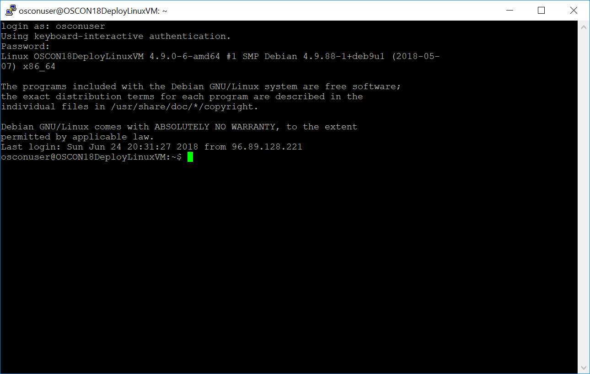

# Create a Linux Virtual Machine on Azure

## Overview

Virtual Machines are a core offering of Microsoft Azure. Users can create multiple VMs from images based on Microsoft Windows Server, as well as on many Linux distributions and BSD variants. Users can create VMs in 50 Azure regions worldwide, and can choose among a large number of configurations and specs.
 
## Objectives 

In this hands-on lab, you will:

- Sign in to the Azure Portal
- Deploy a Linux Virtual Machine on Azure
- Connect to the Linux Virtual Machine using SSH
- Compile and run a simple program written in the C programming language

<a name="Prerequisites"></a>
## Prerequisites ##

- An active Microsoft Azure subscription (credentials provided with this hands-on lab)
- Build-essential / gcc packages
- The vim (Visual Improved) editor is required for this exercise. 

## Exercise A: Create a Linux Virtual Machine using the Azure Portal

### Step 1: Log in to the Azure Portal

1. Open your browser inside the virtual desktop on the left and navigate to https://portal.azure.com

1. Login with the username and password provided at the beginning of this guide.

### Step 2: Create a Linux VM

Once inside the Azure Portal, click on the "Create a resource" button on the top left corner. From the list of options, select Compute to view all kinds of VMs, then click on "See all".


A blade will appear showing a lot of different options for VMs. Some are base images for popular operating systems (including Windows, various Linux distributions, and some BSD variatns). Others are solution templates that automatically deploy multiple VMs (sometimes, dozens) pre-configured for running complex applications, such as Cloud Foundry, DC/OS, SharePoint, and more.

Feel free to browse through the list of VM images, or use the search bar to deploy your favorite **Linux distribution**.


> Not sure what to pick? Here are some ideas that you can search for in the Azure Marketplace:
>
> - Ubuntu Server 16.04 LTS
> - Red Hat Enterprise Linux 7.4
> - Debian 9 "Stretch"
> - CentOS-based 7.4 (*this is CentOS, distributed by Rogue Wave Software*)
> - CoreOS Linux (Stable)
> - Clear Linux OS Basic
> - openSUSE Leap
> - Kali Linux
> 
> Feel free to look for something exotic! 😉
> 
> Also, if you're more of a BSD kind of person, check out FreeBSD!

Once you've picked your favorite image, continue to the next blade. In the images below we're using Ubuntu Server 16.04 LTS as example, but the steps are the same for all other Linux and BSD images.

Make sure that deployment model is "Resource manager" (the default), then click on Create.


You will have to specify a few options:

- Give your VM a name so it's identifiable in the Azure Portal. This will also be the VM's default hostname.
- As disk type, choose "SSD". This will make sure that the VM's OS disk is backed by SSD. The OS disk is always persistent and safely stored in Azure Storage, where it's replicated 3 times.
- Choose the login username (a UNIX username) and password. On a production environment you'll likely want to use SSH public keys instead. Don't forget this password, as you'll need this in a few minutes!
- With this free lab subscription, you should have access to a single Subscription and Resource Group only, already created for you. Make sure you **select the existing Resource Group**!
- Location is the Azure Region where your VM is deployed. You can choose any Region around the world (*please note that your free lab subscription might not be enabled for all Azure Regions*).


The next step is about choosing a size for your VM. Azure offers multiple VM sizes, optimized for different use cases. The main ones are:

- B-series VMs are burstable. They're the cheapest ones, and offer a baseline performance with the ability to burst CPU usage for a short period of time. They're ideal for smaller applications, web servers, small databases, test environments, etc.
- D-series VMs (Dv3, Dv2 and D) are general purpose VMs, suitable for most workloads
- F-series VMs (Fv2 and F) are optimized for CPU-intensive workloads, and have a higher CPU-to-memory ratio.
- E-series VMs (Ev3) are optimized for applications that require a higher memory-to-CPU ratio.

There are many more sizes, designed to accomodate workloads that require GPUs (e.g. for AI or rendering), for high-performance computing, SAP HANA, and more. The [Azure documentation](https://docs.microsoft.com/en-us/azure/virtual-machines/linux/sizes) does a great job explaining all sizes, if you're curious.

In this example, we're picking a B2s VM, but feel free to select something with more RAM or more CPUs.


The last step has some advanced configuration options:+

- You can configure Availability Zones and Availability Sets for high availability when you have 2 or more VMs sharing a workload, up to 99.99%. In this example, do not use Availability Zones and leave Availabily Set to "none".
- Use Managed Disks, and choose a default size for the OS disk.
- This blade allows you to configure the VM's networking profile too. Each VM on Azure is placed in a Virtual Network, which is a private, isolated network inside the Azure fabric, so your VMs can communicate with each other using private IP ranges (such as 10.0.0.0/8), safely. You can also control the allocation of a public IP address if you want your VM to be reachable from clients over the Internet (or not), and you can configure Network Security Group to control traffic (they're essentially firewall rules). For now, leave all settings as default, so a Virtual Network is created with the default options, a public IP is allocated and a Network Security Group is created to allow traffic to port 22 (SSH) only.
- Do not add any extension for now; these could be useful to run a script at the VM startup, for example.
- Disable Boot and Guest OS diagnostic.
- Disable Backup for this lab (although it's a great feature to have in a real-world scenario).


Finally, in the last step you just need to confirm the creation of the VM. You'll be shown the total cost of each VM per hour, which includes the cost of the Azure infrastructure (the compute resources) as well as optionally the cost for the VM image. While most images on the Azure Marketplace are free, some charge an extra fee to cover the licensing cost, such as Red Hat Enterprise Linux.


> [!NOTE] The creation of the VM will take a couple of minutes. Sit back and relax, or take this time as an opportunity to explore the Azure Portal.

### Step 3: Connect to the VM via SSH

Once your VM is up, it should be ready to accept connections via SSH!

On the Azure Portal, select "Virtual Machines" (*not Classic*) on the left sidebar. The VM you just created should appear in the list on the right. Once it's ready, the status will be "Running". Click on the VM to expand its details.


The VM blade has a lot of information! You can see information about the VM, as well as metrics on CPU and memory usage, network and disk I/O, etc. For now, select the Public IP address and copy it.


At this point, connecting to our VM is as easy as opening the terminal and connecting to it via SSH, as you would do with any other Linux/BSD VM.

The remote desktop has PuTTY installed, which is the most popular SSH client for Windows. To open it, click on the Windows start button, then search for "PuTTY".


Type the public IP of the VM in the "Host Name (or IP Address)" field - the one you copied from the Azure Portal; leave every other option as is, then click on "Open".


Accept the security alert that will appear, then log in using your username (in the example, "gilfoyle") and the SSH password that you set while creating the VM.

After authenticating, you'll see a terminal connected to your Linux/BSD VM on Azure, ready for you to do whatever you need!



### Step 4: Compile a simple C program

## Create a local directory to work out of

In a terminal window on your machine, create a directory named `code` and change the current directory to it.

```bash
cd
mkdir code
cd code
pwd
```
The last command above ('pwd') prints the directory you're in


## Start editing your code using vim

If you've never used vim previously, when you launch the editor, you get placed in *navigation/command* mode. Here you can scroll
through any text present in your editor but you cannot edit. To edit inside vim, you have to enter *insert* mode. 
You do that one of two different ways:
- Hit the letter 'a' on your keyboard to insert text after the cursor
- Hit the letter 'i' on your keyboard to insert text at the cursor


To save inside vim, you exit *insert* mode and go back to *command* mode by hitting the "Esc" key on your keyboard. Once in *command* mode, you enter the following sequence of characters (:w or colon-w) and hit "Enter/Return".


For the purposes of this lab, once you open the vim editor (especially if you've never used vim before), please go through the following sequence once you've opened the "vim" editor

- Hit the 'i' key when inside vim to enter *insert* mode
- Copy the following snippet of code from this page:

```bash
#include <stdio.h>

void main()
{
        printf("Hello, I'm at OSCON 2018! \n");
        printf("-------------------------");
}
```
- Inside the vim editor, use the following shortcut (Shift-Insert) on your keyboard
- Hit Esc, type ":w" sans the quotes and hit the Return/Enter key
- Your code is now saved! Now, we get to compile and your snippet of code from within vim


## Compiling and running your code

All of the compilation and execution (running) will be done from within vim's command mode. If you're in *insert* mode, please switch back to *command* mode inside vim by hitting the "Esc" key on the keyboard. After inputting the commands, hit the Return/Enter key every single time. The first command (!gcc HelloWorld.c) [compiles](https://en.wikipedia.org/wiki/Compiler) your program. The second command runs the compiled machine code from the previous step and shows you the output!

```bash
!gcc HelloWorld.c 
!gcc -o HelloWorld % && ./HelloWorld
```

## Compiling your code and viewing the compiled output##


If everything goes well during compilation, you'll see the following output:


## Running your compiled code ##

Now that you've successfully compiled your code, its time to run your compiled code...


Once again, if everything goes as expected, following is the output of your code executing inside a remote Linux VM on Azure:


## Next steps ##

The lab is done! You have now a Linux/BSD VM running on the cloud on Azure, you've successfully connected to it and you've edited, compiled and executed a C program inside vim!

While this lab is over, there's definitely much more about using VMs on Azure. Feel free to explore the features of the Azure Portal: for example, add data disks to your VM, configure the firewall (Network Security Group), enable backups, or whatever else you want to try!
